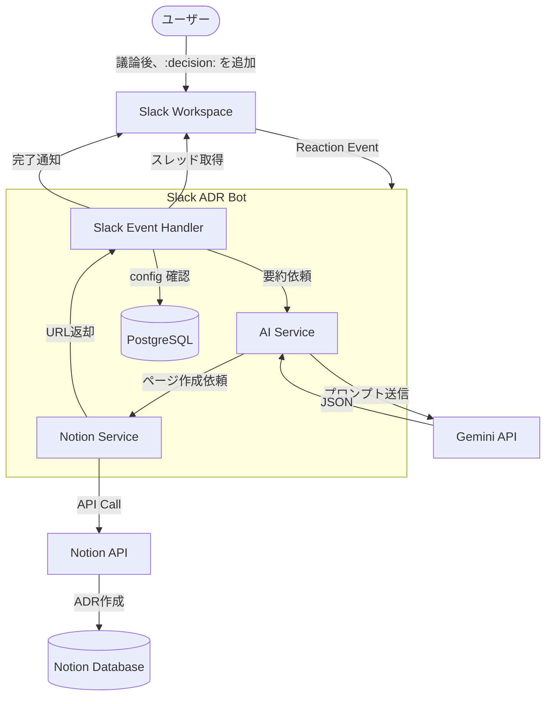
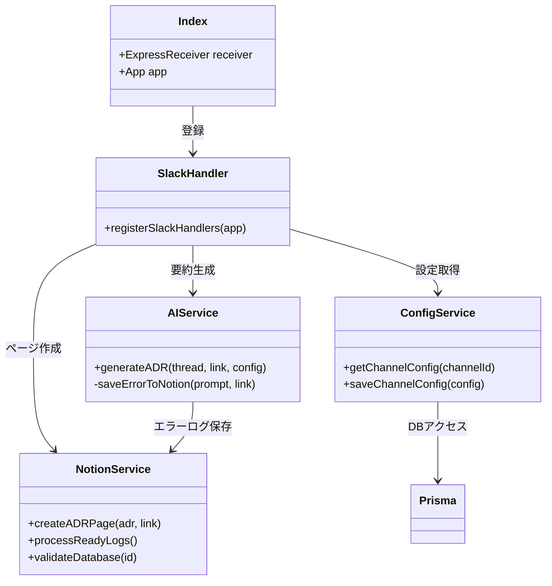
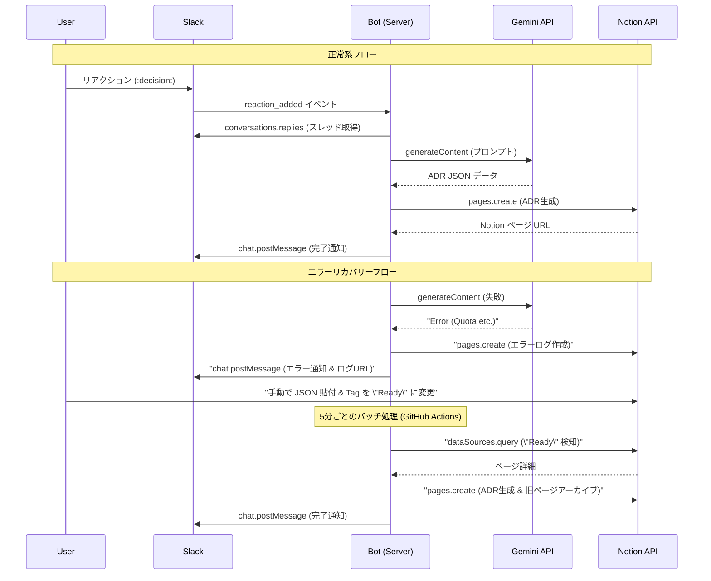
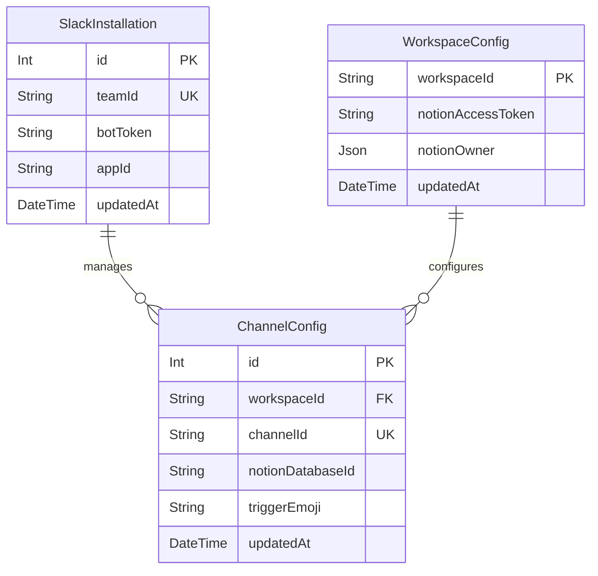

# System Architecture

このドキュメントでは、Slack ADR Bot のシステム構成と動作原理について説明します。

## 1. システム全体像 (System Overview)

Slack スレッドから ADR が生成され、Notion に保存されるまでの全体的なフローです。

## 2. コンポーネント構成 (Component Diagram)

システムの内部コンポーネントと外部依存関係の構成です。

## 3. シーケンス図 (Sequence Diagram)

ADR 生成の成功フローと、エラー時のリカバリーフローの詳細です。

## 4. データモデル (ER Diagram)

Prisma で管理されているデータベースの構造です。

