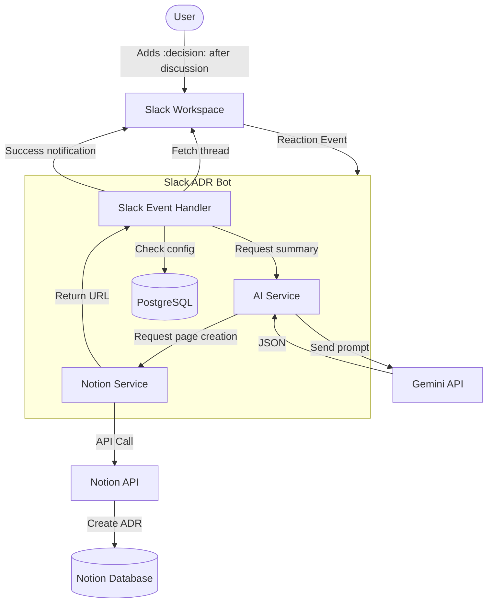
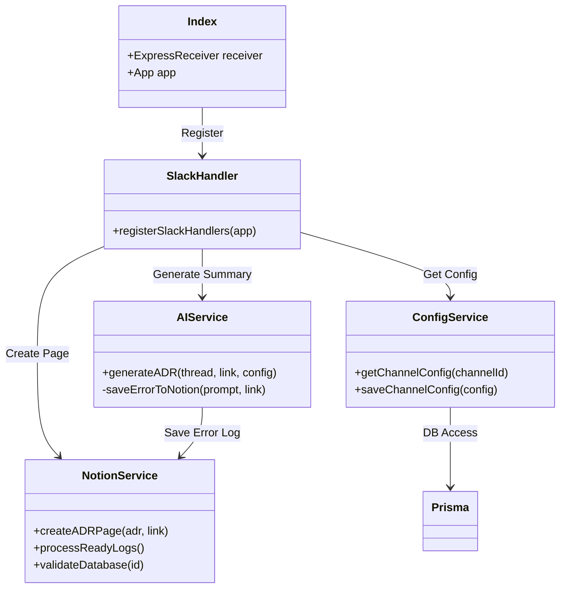
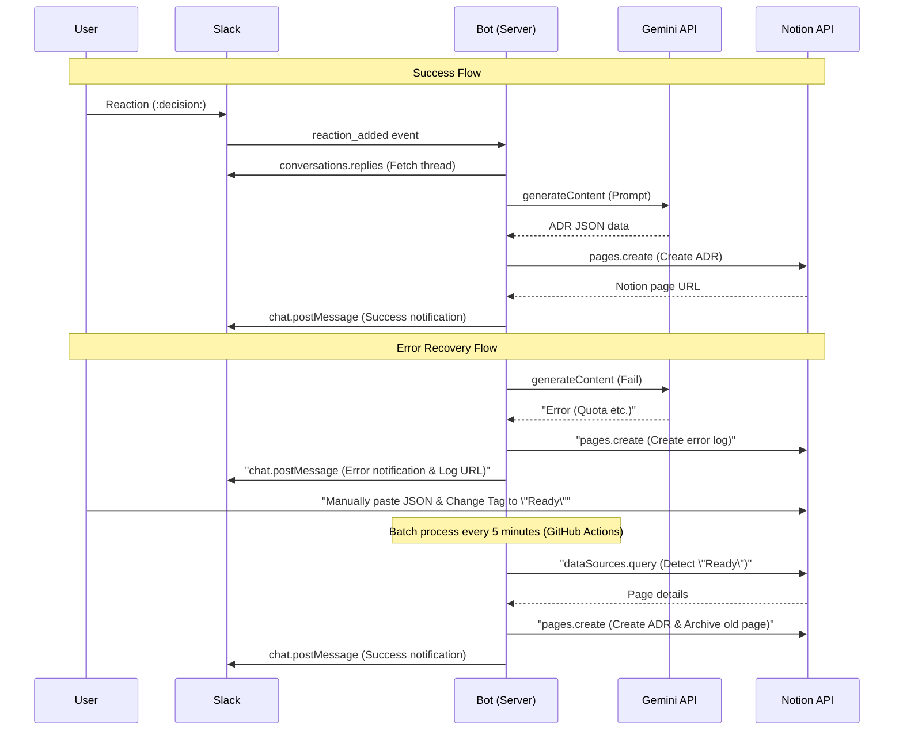
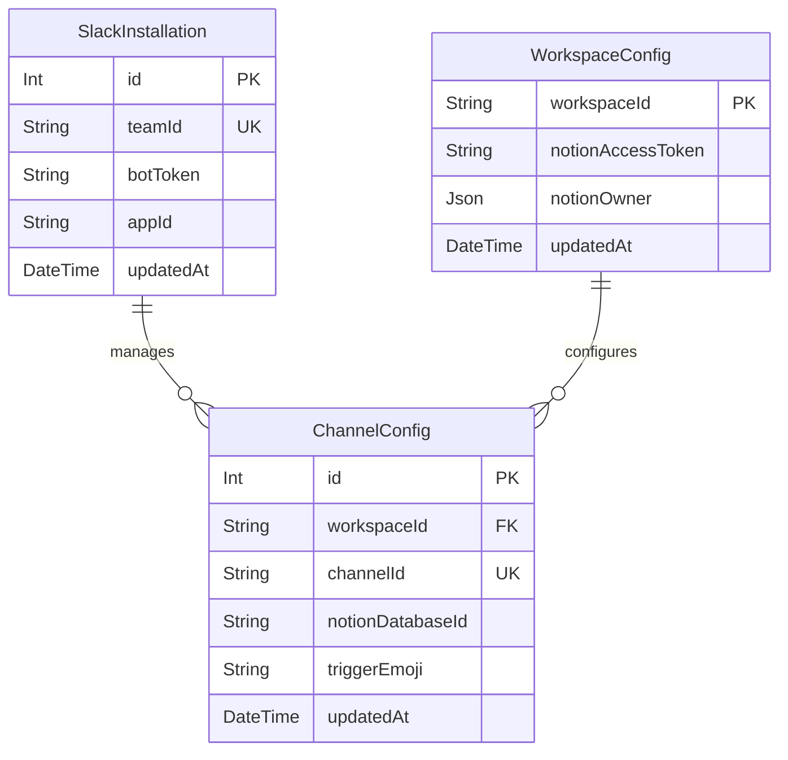

# System Architecture

This document describes the system configuration and operating principles of the Slack ADR Bot.

## 1. System Overview

This diagram shows the end-to-end flow from when a discussion occurs in a Slack thread until the ADR is generated and saved in Notion.

## 2. Component Diagram

The internal components of the system and their external dependencies.

## 3. Sequence Diagram

Details of the successful ADR generation flow and the error recovery flow.

## 4. Data Model (ER Diagram)

The structure of the database managed by Prisma.

