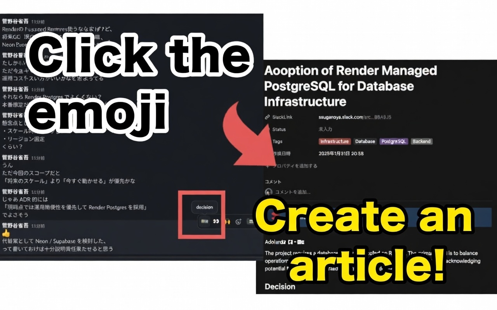
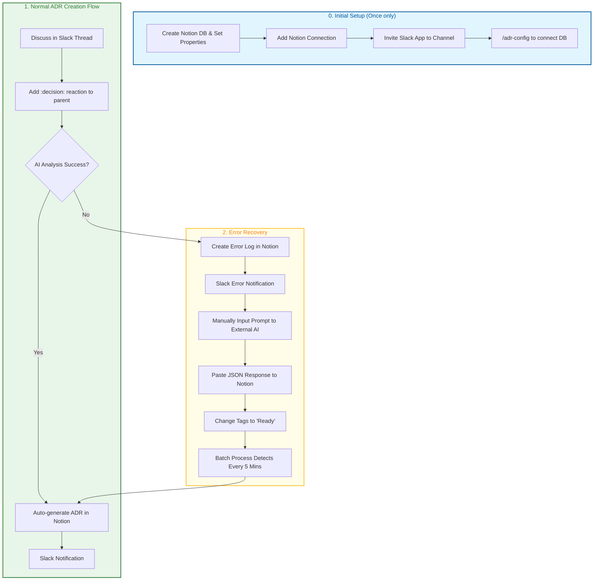

# Slack ADR Bot & Notion Recovery

A tool to automatically generate Architecture Decision Records (ADRs) from Slack conversations and manage them in Notion.
Uses AI (Gemini) to summarize discussions and store them in a database.

[Japanese](./README_ja.md) | **English**

## 🌟 Key Features
- **Slack Integration**: Start ADR creation with a `:decision:` reaction in a thread.
- **AI Auto-Analysis**: Gemini API categorizes discussions into context, decisions, and consequences.
- **Notion Management**: Saves formatted ADRs to a Notion database.
- **Auto-Recovery**: Even if AI analysis fails, logs are kept in Notion for batch recovery later.
- **Channel-specific Settings**: Configure Notion databases individually for each channel via `/adr-config`.

## 🏗️ Architecture
For operating principles and detailed diagrams, see [ARCHITECTURE.md](./ARCHITECTURE.md).

## 📖 Usage

### 0. Prepare Notion Database

Create a Notion database to store ADRs.

1. **Create a new page**: Select "Table - Inline" in Notion.
2. **Add required properties**: (Case-sensitive)
   - `Name` (Title) - Exists by default.
   - `Tags` (Multi-select) - Used for recovery (`Ready` tag).
   - `SlackLink` (URL) - Link to the Slack thread.
3. **Add Connection**: Click "..." at top right -> "Connections" -> "Connect to" and add the ADR integration.
4. **Copy Database URL**: Copy the URL from the browser address bar (used in `/adr-config`).

### 1. Add Slack App to Workspace

1. Create and configure the app in the Slack API Dashboard.
2. Install to your workspace.
3. Invite the app to the channel ( `/invite @app_name` ).

### 2. Channel-specific Configuration

Run `/adr-config` in the channel and enter:
- **Notion Database URL**: The URL where ADRs will be saved.
- **Gemini API Key** (Optional): If you want to use a channel-specific API key.
- **Trigger Emoji**: The emoji that triggers ADR creation (Default: `decision`).

Settings are saved to PostgreSQL.

### 3. Add Emoji (if needed)
If the **Trigger Emoji** does not exist, add it as a custom emoji to your Slack workspace.

### 4. Create ADR

|  |  |
| - | - |
|  |  |

1. Discuss in a Slack thread.
2. Add the **Trigger Emoji** as a reaction to the parent message of the thread.
3. The bot automatically analyzes the thread and creates an ADR in Notion.
4. A link to the Notion page will be posted to Slack upon completion.

### 5. AI Error Recovery Procedure
If the AI API quota is exceeded or an error occurs:

1. **Check Error Log**: A link to the Notion error log page will be posted to Slack.
2. **Manually Send Prompt**:
   - Copy the prompt from the error log page.
   - Send the prompt to an AI like Gemini or ChatGPT.
   - Get the response in JSON format.
3. **Input Result into Notion**:
   - Paste the AI-generated JSON into the **JSON Summary Input** in the error log page.
   - Change the `Tags` property to `Ready`.
4. **Auto-Recovery**: A batch process runs every 5 minutes, detects pages with the `Ready` tag, and creates the ADR.
5. **Completion**: Notification will be sent to Slack once created.
