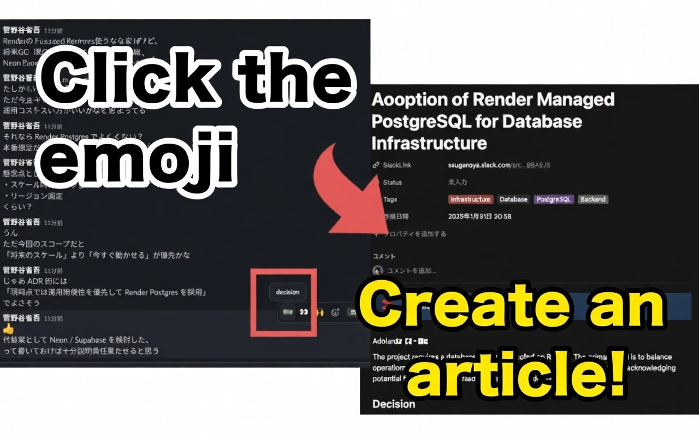
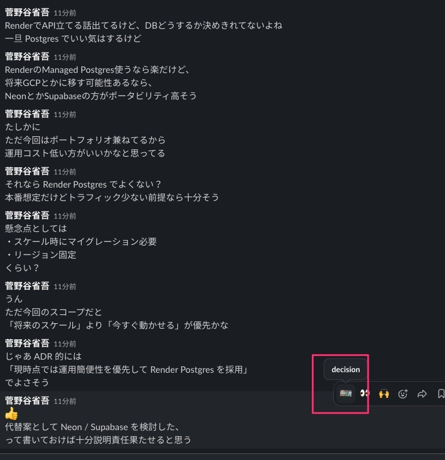
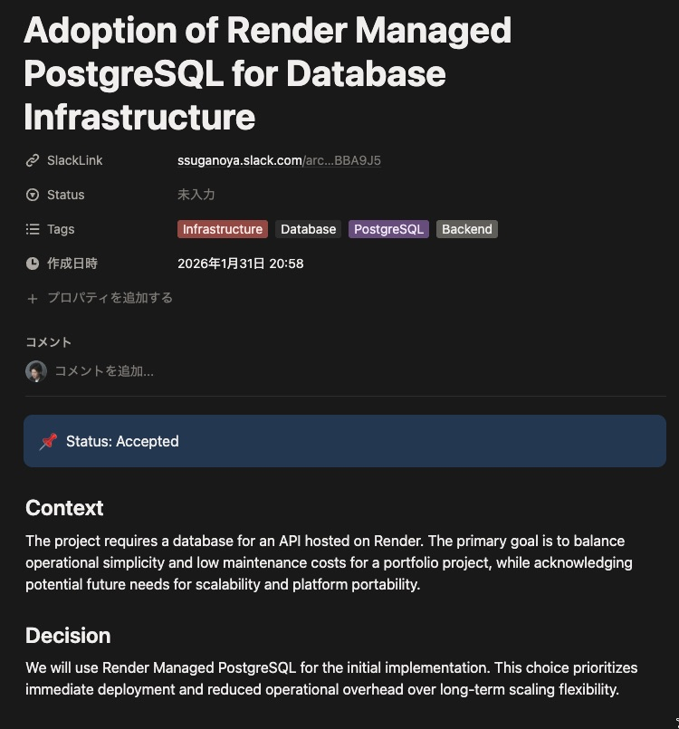

# Slack ADR Bot & Notion Recovery

A tool to automatically generate Architecture Decision Records (ADRs) from Slack conversations and manage them in Notion.
Uses AI (Gemini) to summarize discussions and store them in a database.

[Japanese](./README_ja.md) | **English**

## 🌟 Key Features
- **Slack Integration**: Start ADR creation with a `:decision:` reaction in a thread.
- **AI Auto-Analysis**: Gemini API categorizes discussions into context, decisions, and consequences.
- **Notion Management**: Saves formatted ADRs to a Notion database.
- **Auto-Recovery**: Even if AI analysis fails, logs are kept in Notion for batch recovery later.
- **Channel-specific Settings**: Configure Notion databases individually for each channel via `/adr-config`.

## 🏗️ Architecture
For operating principles and detailed diagrams, see [ARCHITECTURE.md](./ARCHITECTURE.md).

## 📖 Usage
### 0. Prepare Notion Database
Create a Notion database to store ADRs.

1. **Open Template**: Access the [Notion ADR Template](https://believed-eris-e1c.notion.site/3100e2401e48803bb1a4fa1a7a572efb?v=3100e2401e48807d9e17000c9ead4e63&pvs=74)
2. **Duplicate**: Click the "Duplicate" button at the top right to copy it to your workspace.
3. **Copy Database URL**: Copy the URL from your browser's address bar (used later in `/adr-config`).

### 1. Add Slack App to Workspace
1.  Click to install the app in your workspace.
2. Invite the app to the channel where you want to create ADRs ( `/invite @slackADR` ).

### 2. Channel-specific Configuration
Link each channel with a specific Notion database.

1. **Run Command**: Type `/adr-config` in the channel.
2. **Notion Connection**: 
   - Click "Connect to Notion 🔗" to open the authorization page.
   - Select the page containing your database (from Step 0) and grant access.
   - Close the browser tab once successful.
3. **Enter Settings**:
   - **Notion Database URL**: Enter the database URL copied in Step 0.
   - **Gemini API Key** (Optional): Enter a specific API key if you have one.
     - If left blank, manual recovery will be required. See "5. AI Error Recovery Procedure".
   - **Trigger Emoji**: Enter the emoji to trigger ADR creation (Default: `decision`).
4. **Save**: Click "Save" to complete.

### 3. Add Emoji (if needed)
If the **Trigger Emoji** does not exist in your workspace, add it as a custom emoji.

### 4. Create ADR

|  |  |
| - | - |
|  |  |

1. Discuss in a Slack thread.
2. Add the **Trigger Emoji** reaction to the parent message of the thread.
3. The bot automatically analyzes the thread and creates an ADR in Notion.
4. A link to the Notion page will be posted to Slack upon completion.

### 5. AI Error Recovery Procedure
If the AI API quota is exceeded or an error occurs:

1. **Check Error Log**: A link to the Notion error log page will be posted to Slack.
2. **Manually Send Prompt**:
   - Copy the prompt from the error log page.
   - Send the prompt to an AI like Gemini or ChatGPT.
   - Get the response in JSON format.
3. **Input Result into Notion**:
   - Paste the AI-generated JSON into the **JSON Summary Input** in the error log page.
   - Change the `Tags` property to `Ready`.
4. **Auto-Recovery**: A batch process runs every 5 minutes, detects pages with the `Ready` tag, and creates the ADR.
5. **Completion**: Notification will be sent to Slack once created.
