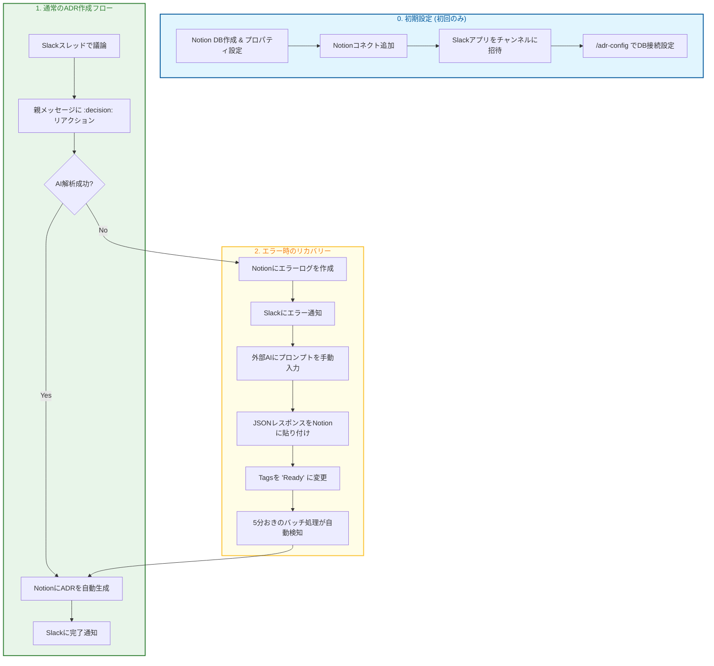

# Slack ADR Bot & Notion Recovery

Slack の会話からアーキテクチャ意思決定記録 (ADR) を自動生成し、Notion で管理するためのツールです。
AI (Gemini) を使用して議論を要約し、データベース化します。

## 🌟 主な機能
- **Slack 連携**: スレッドの `:decision:` リアクションで ADR 作成を開始
- **AI 自動解析**: Gemini API が議論をコンテキスト、決定事項、影響に分類
- **Notion 管理**: 整形された ADR を Notion データベースに保存
- **自動リカバリー**: AI 解析に失敗した場合も Notion にログを残し、後から一括リカバリー可能
- **チャンネルごとの設定**: `/adr-config` で Notion データベースを個別に設定可能

## 📖 使い方

### 0. Notion データベースの準備

ADR を保存するための Notion データベースを作成します。

1. **新しいページを作成**: Notion で新しいページを作成し、「テーブル - インライン」を選択
2. **必須プロパティの追加**: 以下のプロパティが必要です（大文字・小文字を正確に入力してください）
   - `Name` (タイトル) - デフォルトで存在
   - `Tags` (マルチセレクト) - リカバリー機能で使用（`Ready` タグを追加）
   - `SlackLink` (URL) - Slack スレッドへのリンク
3. **コネクトの追加**: ページ右上の「︙」→「コネクト」→「新しいコネクト」を選択し、ADR データベースを追加
4. **データベース URL をコピー**: ブラウザのアドレスバーから URL をコピー（後で `/adr-config` で使用）

### 1. Slack アプリをワークスペースに追加

1. Slack API ダッシュボードでアプリを作成・設定
2. ワークスペースにインストール
3. ADR を作成したいチャンネルにアプリを招待（`/invite @アプリ名`）

### 2. チャンネルごとの設定

チャンネルで `/adr-config` を実行し、モーダルに以下を入力：
- **Notion Database URL**: ADR を保存する Notion データベースの URL
- **Gemini API Key** (オプション): チャンネル専用の API キーを使う場合
- **Trigger Emoji**: ADR 作成のトリガーとなる絵文字（デフォルト: `decision`）

「保存」をクリックすると、設定が PostgreSQL に保存されます。

### 3. 絵文字の追加（必要に応じて）
**Trigger Emoji**の絵文字がない場合は、Slack ワークスペースにカスタム絵文字を追加してください。

### 4. ADR の作成

|  |  |
| - | - |
|  |  |

1. Slack のスレッドで議論を行う
2. スレッドの親メッセージに設定した**Trigger Emoji**をリアクションとして追加
3. Bot が自動的にスレッド全体を解析し、ADR を Notion に作成
4. 作成完了後、Slack に Notion ページのリンクが通知されます

### 5. AI エラー時のリカバリー手順
AI API のクォータ超過やエラーが発生した場合：

1. **エラーログの確認**: Slack に Notion のエラーログページのリンクが通知されます
2. **手動でプロンプトを送信**: 
   - エラーログページに記載されているプロンプトをコピー
   - ブラウザで Gemini や ChatGPT などの AI にプロンプトを送信
   - レスポンスを JSON 形式で取得
3. **Notion に結果を入力**:
   - エラーログページの **JSON Summary Input** に AI のレスポンスを貼り付け
   - `Tags` プロパティを `Ready` に変更
4. **自動リカバリー**: 5分おきに実行されるバッチ処理が `Ready` タグのページを検出し、ADR を自動作成
5. **完了通知**: ADR が作成されると、Slack に通知が届きます

---

## 📊 開発進捗

### ✅ 完了
- ローカル環境での動作確認完了

### 🚧 今後の予定
- Slack アプリの公開申請
- Notion インテグレーションの公開申請
