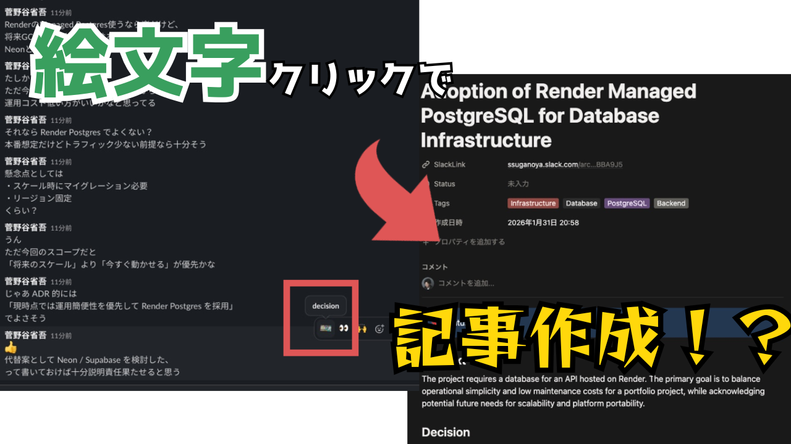

# Slack ADR Bot & Notion Recovery

Slack の会話からアーキテクチャ意思決定記録 (ADR) を自動生成し、Notion で管理するためのツールです。
AI (Gemini) を使用して議論を要約し、データベース化します。

**日本語** | [English](./README.md)

## 🌟 主な機能
- **Slack 連携**: スレッドの `:decision:` リアクションで ADR 作成を開始
- **AI 自動解析**: Gemini API が議論をコンテキスト、決定事項、影響に分類
- **Notion 管理**: 整形された ADR を Notion データベースに保存
- **自動リカバリー**: AI 解析に失敗した場合も Notion にログを残し、後から一括リカバリー可能
- **チャンネルごとの設定**: `/adr-config` で Notion データベースを個別に設定可能

## デモ動画
<iframe width="560" height="315" src="https://www.youtube.com/embed/xcHaS9UBwDU?si=sK97Wd6D3xN3qKvy" title="YouTube video player" frameborder="0" allow="accelerometer; autoplay; clipboard-write; encrypted-media; gyroscope; picture-in-picture; web-share" referrerpolicy="strict-origin-when-cross-origin" allowfullscreen></iframe>

## 🏗️ アーキテクチャ
システムの動作原理や詳細な構成図については、[ARCHITECTURE.md](./ARCHITECTURE.md) を参照してください。

## ⚠️ 注意事項
- **データの保存について**: Slack の会話内容はデータベースに保存されません。メモリ上で一時的に処理され、ADR 生成（要約）のためにのみ使用されます。
- **プライバシー**: AI に送信される情報に個人情報や機密情報が含まれないよう、入力内容には十分注意してください。

## 📖 使い方
### 0. Notion データベースの準備
ADR を保存するための Notion データベースを作成します。

1. **テンプレートを開く**: [Notion ADR テンプレート](https://believed-eris-e1c.notion.site/3100e2401e48803bb1a4fa1a7a572efb?v=3100e2401e48807d9e17000c9ead4e63&pvs=74) にアクセス
2. **複製 (Duplicate)**: 画面右上の「複製」ボタンをクリックして、自分のワークスペースにコピー
3. **データベース URL をコピー**: ブラウザのアドレスバーから URL をコピー（後で `/adr-config` で使用）

### 1. Slack アプリをワークスペースに追加
1.  をクリックして、ワークスペースにアプリをインストール
2. ADR を作成したいチャンネルにアプリを招待（`/invite @slackADR`）

### 2. チャンネルごとの設定
ADR を作成したい各チャンネルで、Notion データベースとの紐付けを行います。

1. **コマンドの実行**: チャンネルで `/adr-config` を入力して実行
2. **Notion 連携**: 
    - 「Connect to Notion 🔗」ボタンをクリックし、ブラウザで連携ページを開く
    - 連携したいページ（手順 0 で作成したデータベースを含むページ）を選択し、アクセスを許可
        - この時、すでにチェックがついているものはチェックを外さないことを推奨します。他のチャンネルで使用している可能性があります。
    - 成功画面が表示されたらタブを閉じて Slack に戻る
3. **設定の入力**:
    - **Notion Database URL**: 手順 0 でコピーしたデータベースの URL を入力
    - **Gemini API Key** (オプション): ADR作成に使用するGeminiAPIキーを設定
        - 未設定の場合、手動でのリカバリーが必要になります。詳細は「5. AI エラー時のリカバリー手順」を参照してください。
    - **Trigger Emoji**: ADR 作成のトリガーとなる絵文字を入力（デフォルト: `decision`）
4. **保存**: 「Save」ボタンをクリックして完了

### 3. 絵文字の追加（必要に応じて）
**Trigger Emoji**の絵文字がない場合は、Slack ワークスペースにカスタム絵文字を追加してください。

### 4. ADR の作成

|  |  |
| - | - |
|  |  |

1. Slack のスレッドで議論を行う
2. スレッドの親メッセージに設定した**Trigger Emoji**をリアクションとして追加
3. Bot が自動的にスレッド全体を解析し、ADR を Notion に作成
4. 作成完了後、Slack に Notion ページのリンクが通知されます

### 5. AI エラー時のリカバリー手順
AI API のクォータ超過やエラーが発生した場合：

1. **エラーログの確認**: Slack に Notion のエラーログページのリンクが通知されます
2. **手動でプロンプトを送信**: 
    - エラーログページに記載されているプロンプトをコピー
    - ブラウザで Gemini や ChatGPT などの AI にプロンプトを送信
    - レスポンスを JSON 形式で取得
3. **Notion に結果を入力**:
    - エラーログページの **JSON Summary Input** に AI のレスポンスを貼り付け
    - `Tags` プロパティを `Ready` に変更
4. **自動リカバリー**: 5分おきに実行されるバッチ処理が `Ready` タグのページを検出し、ADR を自動作成
5. **完了通知**: ADR が作成されると、Slack に通知が届きます
